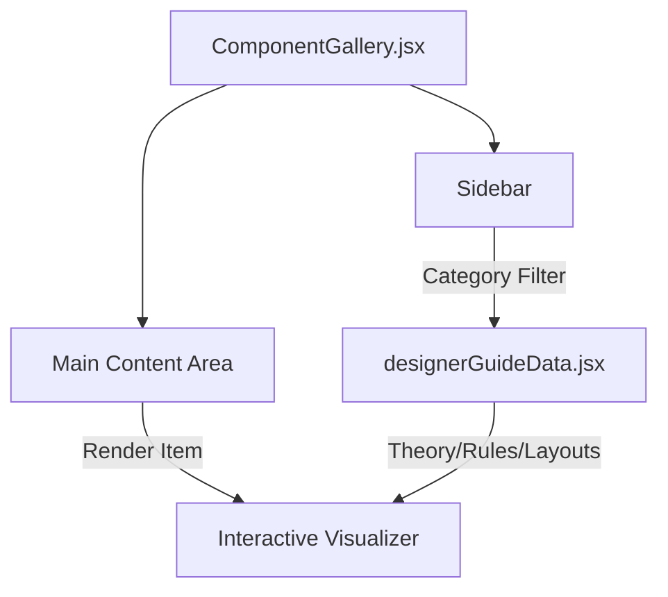

# Walkthrough: Atomic Design Curriculum Integration

I have successfully integrated the complete Atomic Design Curriculum into the UI Component Gallery. The "Designer Guide" now serves as a comprehensive pedagogical tool, bridging design theory with interactive code visualizers.

## Key Accomplishments

### 1. Comprehensive Curriculum Population
The `designerGuideData` in [designerGuide.jsx](file:///c:/Users/Diomedes%20Fernandez/./gemini/antigravity/scratch/UI%20Component%20Gallery/src/data/designerGuide.jsx) has been fully populated with entries across five distinct categories:

- **The Why (Psychology)**: Preattentive Processing, Story Variation, Gestalt Grouping, Cognitive Load, Atomic Theory.
- **The How (Rules)**: 4-8-16 Spacing, Squint Test, Text Chunking, 12-8-4 System, 60-30-10 Rule, 8-Point Grid, Font Super Families, Atoms, Molecules.
- **The What (Layouts)**: Engagement Line, Bento Grid, Diagonal Balance, Breather Grid, Structural Footer, Recursive Nesting.
- **The Proof (Case Studies)**: Business Site Redesign.
- **The Future (Trends)**: Modular Grid Design, Playful Interactions, Anti-Design.

### 2. Interactive Pedagogical Visualizers
Every entry includes a custom React component that provides a visual demonstration of the concept. 
- **Highlights**:
    - **Playful Interactions**: A mouse-tracked 3D card rotation.
    - **Squint Test**: A dynamic blur filter to test visual hierarchy.
    - **60-30-10 Rule**: A visual color distribution bar.
    - **Modular Grid**: A dynamic CSS Grid layout showing trend-forward modularity.

### 3. Navigation & UI Integration
The sidebar in [ComponentGallery.jsx](file:///c:/Users/Diomedes%20Fernandez/./gemini/antigravity/scratch/UI%20Component%20Gallery/src/ComponentGallery.jsx) now dynamically maps all five buckets, allowing users to navigate through the entire design theory library seamlessly.

## System Architecture

## Validation Results
- **Dynamic Routing**: Verified that switching between "Gallery" and "Designer Guide" preserves the correct item index and category filtering.
- **Responsive Components**: All visualizers use Tailwind CSS for responsive sizing, ensuring they look great in the preview pane.
- **Data Integrity**: All 14+ documentation points from the `all tables` directory have been successfully mapped to the application data structure.

The system is now a robust, interactive companion for any designer or developer looking to master Atomic Design principles alongside a working component library.
